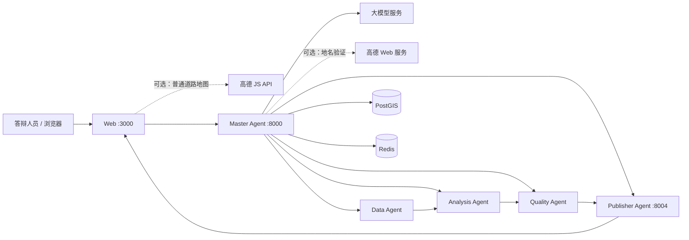

# 神农溪分布式多 Agent GIS 演示系统

这是一个面向实习答辩的中文地图应用。你可以用自然语言提交对神农溪植被变化的分析需求，系统会：
- 调用大模型（如 GPT、Claude 等）生成分析计划
- 由 5 个独立的 Agent 协同完成：Master 负责协调，Data 准备数据，Analysis 计算植被指数，Quality 检查质量，Publisher 发布结果
- 最终在网页上展示植被变化地图、统计数据和中文 PDF 报告

**当前状态**：代码和自动化测试已完成。但在正式答辩前，需要在目标机器上使用真实的大模型配置完整演练一遍，并保存证据。自动化测试只能证明流程通顺，不能代替真实演练。

## 项目能展示什么

- **真实的多 Agent 协作**：5 个 Agent 真的在独立运行、相互调用，不是前端模拟出来的进度动画
- **真实的遥感计算**：使用 2019-08-19 和 2024-08-12 两期 Sentinel-2 卫星的红光/近红外数据，计算真实的植被指数（NDVI）
- **完整的 GIS 处理流程**：裁剪神农溪流域、计算差值、分级统计、面积计算，还有独立的质量检查
- **地图展示**：没有成果时显示高德地图作为背景参考；成果计算完成后切换到 MapLibre 显示三种分析结果
- **中文友好**：Agent 执行时间线、刷新恢复、失败重试都有中文提示
- **报告绑定**：每个任务都有专属的中文 PDF 报告，带有校验和防篡改
- **可选的高德增强**：可以用高德 Web 服务验证地名；高德服务不可用时，已批准的遥感分析流程仍可正常继续

## 系统组成



**端口说明**：
- 你的电脑（宿主机）只开放 `127.0.0.1` 的三个端口：Web (3000)、Master (8000)、Publisher (8004)
- Data、Analysis、Quality、PostGIS 和 Redis 只在 Docker 内部网络运行，外部无法直接访问
- PostGIS 保存工作流的核心数据，Redis 只做事件缓存；即使 Redis 出问题，任务状态也能从 PostGIS 恢复

## 运行前准备

目标运行环境是 Apple Silicon Mac（`linux/arm64`），需要准备：

- **Docker 环境**：已启动的 OrbStack 或 Docker Desktop，以及 Docker Compose 插件
- **Git**：用于克隆代码
- **Python 3.12 和 uv**：用于数据预检和本地验证（按仓库锁定的版本安装）
- **离线数据**：在 `data/cache/demo/` 下放置四个已批准的 GeoTIFF 文件（不包含在 Git 中）
- **配置信息**：
  - 必需：一组有效的大模型 API 配置（Key、Base URL、模型名）
  - 可选：高德 Web 服务 Key（用于地名验证）
  - 可选：高德 Web 端 JS API Key 和安全密钥（用于浏览器地图）

依赖及固定版本详见 [`docs/dependencies.md`](docs/dependencies.md)。

**安全提醒**：真实配置只能写在被 Git 忽略的 `.env` 文件中，不能写入源码、README 或命令记录。高德的 JS API Key 会进入浏览器，因此必须使用专用、可轮换且受域名约束的 Key；Web 服务 Key 和安全密钥绝不能进入浏览器。

## 第一次启动

以下命令都从仓库根目录执行。

### 1. 准备本地配置

```bash
cp .env.example .env
```

编辑 `.env`，至少填写以下三项（**必需**）：

```dotenv
LLM_API_KEY=你的大模型API密钥
LLM_BASE_URL=大模型接口地址
LLM_MODEL=模型名称
```

**可选配置**（如果要展示高德地图功能）：
- 如果需要 Master 在线验证研究区地名，填写 `AMAP_WEB_SERVICE_KEY`
- 如果需要在首页和任务期间显示高德地图背景，填写 `VITE_AMAP_JS_API_KEY` 和 `AMAP_JS_API_SECURITY_CODE`
  - 注意：前者是浏览器可见的 Web 端 Key，后者只由服务端读取
  - 这两个 Key 必须来自同一个高德应用，且不能与 Web 服务 Key 混用

**重要**：
- 不要在变量值中加入示例里的中文说明文字
- 不要把 `.env` 文件提交到 Git
- 申请高德 Key 和域名限制的详细步骤见 [`docs/setup.md`](docs/setup.md)

### 2. 预检离线数据

确认下列文件已经由项目交付者通过安全渠道提供，并放在正确位置：

```text
data/cache/demo/before_red.tif
data/cache/demo/before_nir.tif
data/cache/demo/after_red.tif
data/cache/demo/after_nir.tif
```

然后执行离线校验脚本：

```bash
uv run --frozen python scripts/data_preflight.py
```

**只有所有检查项都显示 `PASS` 时才能继续**。答辩当天不应重新下载或重新制作影像。

### 3. 初始化数据库和数据卷

```bash
# 1. 检查配置是否正确
docker compose config --quiet

# 2. 构建镜像
docker compose build

# 3. 启动数据库和缓存
docker compose up --detach --wait postgis redis

# 4. 执行数据库迁移
docker compose run --rm --no-deps master-agent alembic upgrade head
docker compose run --rm --no-deps master-agent alembic current --check-heads

# 5. 启动数据服务并复制数据文件
docker compose up --detach --wait data-agent
docker compose cp data/cache/demo/before_red.tif data-agent:/data/cache/before_red.tif
docker compose cp data/cache/demo/before_nir.tif data-agent:/data/cache/before_nir.tif
docker compose cp data/cache/demo/after_red.tif data-agent:/data/cache/after_red.tif
docker compose cp data/cache/demo/after_nir.tif data-agent:/data/cache/after_nir.tif
```

**注意**：迁移只允许向前执行。不要对共享或演示数据库执行降级，也不要手工修改 `alembic_version` 表。

### 4. 启动并检查

```bash
# 启动所有服务
docker compose up --detach --wait

# 检查健康状态
curl --fail --silent --show-error http://127.0.0.1:8000/api/v1/health
curl --fail --silent --show-error http://127.0.0.1:8000/api/v1/config/readiness

# 查看服务状态
docker compose ps
```

在浏览器中打开 [http://localhost:3000](http://localhost:3000)。建议使用以下任务进行演示：

> 分析神农溪 2019 至 2024 年植被变化

**预期行为**：
- 任务应按顺序经过：`PENDING` → 规划 → 数据准备 → 分析 → 质量检查 → 发布 → `COMPLETED`
- 只有在质量通过且成果齐全时，任务才会标记为 `COMPLETED`

**关于地图显示**：
- **如果配置了高德 Web 端凭据**：无任务和任务执行期间会显示”高德位置参考”地图；当成果计算完成后，高德地图会被销毁，页面切换为 MapLibre 显示分析结果
- **如果未配置或高德加载失败**：直接显示离线占位图，不会影响任务创建、执行、重试或成果展示

## 日常启动与停止

数据库迁移和数据卷已经准备好后，日常启动只需：

```bash
docker compose up --detach --wait
```

停止服务（**不会删除数据**）：

```bash
docker compose down
```

**警告**：不要在演示机器上使用 `docker compose down --volumes` 或 `docker compose down -v`，这些命令会删除 PostGIS、Redis、离线影像缓存和已生成成果的数据卷。

## 验证入口

完整的端到端浏览器测试使用确定性的小数据集、模拟的大模型和位置服务，不会消耗真实的 API 额度：

```bash
./tests/e2e/run.sh
```

这个脚本可以证明界面和工作流能够正常运行，但**不能代替**真实大模型、真实栅格数据和可选的高德服务验证。

更详细的开发命令见 [`docs/development.md`](docs/development.md)。

完整的需求、实施证据和待办状态分别见：
- [`docs/spec.md`](docs/spec.md) - 项目规格说明
- [`tasks/plan.md`](tasks/plan.md) - 实施计划和证据
- [`tasks/todo.md`](tasks/todo.md) - 待办事项

## 安全与数据边界

- **密钥隔离**：
  - 大模型 Key 和高德 Web 服务 Key 只注入 Master 服务
  - 高德安全密钥只注入 Web 服务端
  - 只有专用的高德 JS API Key 按官方机制对浏览器可见
  
- **高德服务的使用范围**：
  - 高德 Web 服务只用于校验”神农溪/巴东县”地名
  - 高德 JS API 只在没有分析成果时提供地图背景参考
  - 这两项都不会替代已批准的 WGS84 流域边界、Sentinel-2 数据、MapLibre 成果地图或质量检查
  
- **数据保护**：
  - 浏览器只发送一个固定的中心点坐标做临时坐标转换
  - 不向高德发送完整的用户提示、任务 ID、栅格数据、流域几何或分析成果
  - 不持久化高德脚本、地图瓦片、转换结果或原始响应
  
- **文件保护**：
  - 原始影像、缓存影像、生成的栅格、报告、日志、测试截图和 `.env*` 配置文件都被 `.gitignore` 排除，不会进入 Git
  
- **发布保护**：
  - Publisher 只发布通过任务归属、校验和验证和质量结论复核的成果

## 数据与许可

**数据来源**：
- 流域边界来自 WWF HydroSHEDS / HydroBASINS
- 双时相影像为 Copernicus Sentinel-2 L2A 数据

准确的产品标识、来源地址、许可证、处理方法、日期、投影、大小和 SHA-256 校验和以 [`data/manifest.json`](data/manifest.json) 为准。

项目依赖及字体许可记录见 [`docs/dependencies.md`](docs/dependencies.md)。

## 项目文档

- [`docs/architecture.md`](docs/architecture.md) - 组件职责、工作流、状态机、数据流与安全边界
- [`docs/setup.md`](docs/setup.md) - 目标机器首次安装、真实配置、数据卷和上游验证
- [`docs/demo-runbook.md`](docs/demo-runbook.md) - 答辩前演练、现场讲解、失败/重试和离线降级步骤
- [`docs/verification.md`](docs/verification.md) - T28 目标机验收清单与证据模板
- [`docs/troubleshooting.md`](docs/troubleshooting.md) - 按症状定位依赖并做非破坏性恢复
- [`docs/spec.md`](docs/spec.md) - 已批准的产品与工程规格
- [`docs/development.md`](docs/development.md) - 开发、集成测试和各 Agent 的详细验证命令
- [`docs/openapi.yaml`](docs/openapi.yaml) - 公开接口契约
- [`docs/decisions/001-postgis-durable-workflow.md`](docs/decisions/001-postgis-durable-workflow.md) - PostGIS/Redis 持久化边界的架构决策
- [`tasks/plan.md`](tasks/plan.md) 与 [`tasks/todo.md`](tasks/todo.md) - 实施历史、验收证据和剩余交接项

## 当前交接状态

**已完成的内容（T01–T27 与 T29）**：
- ✅ 高德真实在线浏览器验证
- ✅ 任务期间复用高德地图实例
- ✅ MapLibre 成果地图切换
- ✅ 安全边界设计与实施
- ✅ 离线回退自动化
- ✅ 确定性端到端测试

**待完成的内容（T28）**：
中文交接文档已齐备，但以下项目仍待完成：
- ⏳ 在目标机器上使用真实大模型和栅格数据进行完整演练
- ⏳ 在实际机器上验证文档的准确性
- ⏳ 提供具名的交接证据

**重要提醒**：在完成上述待办项并通过验收之前，不得对外声称项目已完成最终答辩验收。

---

**注意**：项目所有者已取消目标机器主动断网的人工验收步骤。这不表示已经执行过真实断网测试，运行时降级规则和自动化回归测试仍然保留。T29 以真实在线结果，加上组件测试和隔离的 Playwright 网络失败旅程中的降级证据作为验收标准。
