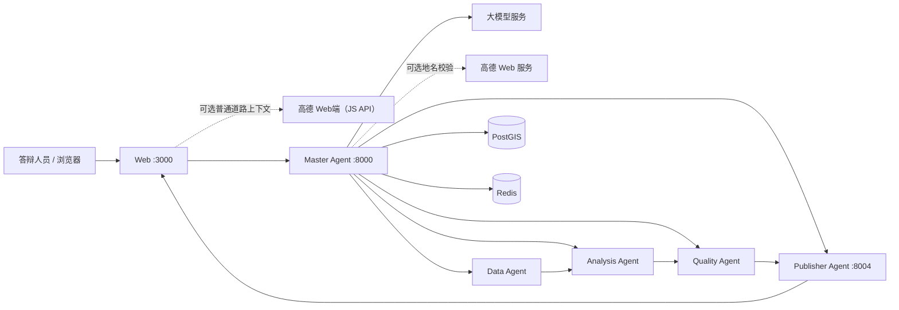

# 神农溪分布式多 Agent GIS 演示系统

这是一个面向实习答辩的中文地图应用：用户用自然语言提交神农溪植被变化分析任务，Master
Agent 调用大模型生成受约束计划，再通过容器私网依次协调 Data、Analysis、Quality 和 Publisher
四个 Agent，最终在 Web 页面展示双时相 NDVI、变化分级、质量证据和中文 PDF 报告。

当前代码、自动化浏览器验收和运行加固已完成；真实答辩演练仍需接手人在目标机器上使用有效的
大模型配置执行并留存证据。不要把自动化测试结果当成真实演练记录。

## 项目能展示什么

- 一条可观察的五 Agent 工作流，而不是前端伪造的进度动画。
- 2019-08-19 与 2024-08-12 两期 Sentinel-2 红光/近红外数据的真实 NDVI 计算。
- 完整神农溪流域裁剪、差值分级、面积统计和独立质量门禁。
- 无成果时可显示高德普通道路上下文地图，合法成果到达后切换为 MapLibre 三类栅格图层。
- 中文 Agent 时间线、刷新恢复、失败与安全重试。
- 与任务严格绑定的中文 PDF 报告及成果校验和。
- 可选的高德 Web 服务研究区地名校验；高德不可用时，已批准的离线遥感主链仍可继续。

## 系统组成



宿主机只开放回环地址上的 Web、Master 和 Publisher 端口。Data、Analysis、Quality、PostGIS
和 Redis 只位于 Compose 私网，不能从宿主机直接访问。PostGIS 保存工作流事实，Redis 只承担
有界事件缓存与分发；即使 Redis 丢失，任务仍可从 PostGIS 重建。

## 运行前准备

目标运行环境是 Apple Silicon（`linux/arm64`），需要：

- 已启动的 OrbStack 或 Docker Desktop，以及 Docker Compose 插件；
- Git；
- 按仓库锁定版本安装的 Python 3.12 与 `uv`（用于数据预检和本地验证）；
- `data/cache/demo/` 下四个已批准且未纳入 Git 的 GeoTIFF；
- 一组有效的大模型 API 配置；高德 Web 服务 Key、Web端（JS API）Key 与安全密钥均为可选项。

依赖及固定版本见 [`docs/dependencies.md`](docs/dependencies.md)。真实值只能写入被 Git 忽略的
`.env`，不能写入源码、README 或命令记录。Web端（JS API）Key 按高德机制会进入浏览器，因此
必须使用专用、可轮换且受域名约束的 Key；Web 服务 Key 和安全密钥绝不能进入浏览器 bundle。

## 第一次启动

以下命令都从仓库根目录执行。

### 1. 准备本地配置

```bash
cp .env.example .env
```

编辑 `.env`，至少填写：

```dotenv
LLM_API_KEY=替换为真实值
LLM_BASE_URL=替换为兼容接口地址
LLM_MODEL=替换为实际模型名
```

如需 Master 在线校验研究区，再填写 `AMAP_WEB_SERVICE_KEY`。如需首页和任务期间显示高德普通
道路上下文地图，再填写同一高德应用签发的独立 `VITE_AMAP_JS_API_KEY` 与
`AMAP_JS_API_SECURITY_CODE`；前者是浏览器可见的 Web端 Key，后者只由 Web 同源代理读取。
三者不得复用。不要给变量值加示例中的中文占位文本，也不要把 `.env` 提交到 Git。申请与域名
限制步骤见 [`docs/setup.md`](docs/setup.md)。

### 2. 预检离线数据

确认下列文件已经由项目交付者通过安全渠道提供：

```text
data/cache/demo/before_red.tif
data/cache/demo/before_nir.tif
data/cache/demo/after_red.tif
data/cache/demo/after_nir.tif
```

然后执行离线校验：

```bash
uv run --frozen python scripts/data_preflight.py
```

只有输出以 `PASS` 结束时才继续。答辩当天不应重新下载或重新制作影像。

### 3. 初始化数据库和数据卷

```bash
docker compose config --quiet
docker compose build
docker compose up --detach --wait postgis redis
docker compose run --rm --no-deps master-agent alembic upgrade head
docker compose run --rm --no-deps master-agent alembic current --check-heads
docker compose up --detach --wait data-agent
docker compose cp data/cache/demo/before_red.tif data-agent:/data/cache/before_red.tif
docker compose cp data/cache/demo/before_nir.tif data-agent:/data/cache/before_nir.tif
docker compose cp data/cache/demo/after_red.tif data-agent:/data/cache/after_red.tif
docker compose cp data/cache/demo/after_nir.tif data-agent:/data/cache/after_nir.tif
```

迁移只允许向前执行。不要对共享或演示数据库执行降级，也不要手工修改 `alembic_version`。

### 4. 启动并检查

```bash
docker compose up --detach --wait
curl --fail --silent --show-error http://127.0.0.1:8000/api/v1/health
curl --fail --silent --show-error http://127.0.0.1:8000/api/v1/config/readiness
docker compose ps
```

浏览器打开 [http://localhost:3000](http://localhost:3000)。建议使用的演示任务是：

> 分析神农溪 2019 至 2024 年植被变化

任务应从 `PENDING` 依次进入规划、数据准备、分析、质量检查和发布阶段，最后只有在质量通过且
成果齐全时进入 `COMPLETED`。

已配置独立 Web端凭据时，无任务和任务执行期间显示“高德位置参考”；合法 publication 到达后
高德实例被销毁，页面切换为 MapLibre 成果地图。未配置或高德加载失败时显示原离线占位图，
不会阻断任务创建、时间线、分析、重试或成果展示。

## 日常启动与停止

数据库迁移和数据卷已经准备好时，日常启动只需：

```bash
docker compose up --detach --wait
```

非破坏性停止：

```bash
docker compose down
```

不要在演示机器上使用 `docker compose down --volumes` 或 `docker compose down -v`，否则会删除
PostGIS、Redis、离线影像缓存和已生成成果的命名卷。

## 验证入口

完整 Compose 浏览器旅程使用确定性小数据、假大模型、假位置服务和被路由拦截的假高德 Loader，
不消耗真实 API 额度：

```bash
./tests/e2e/run.sh
```

它证明界面和工作流可运行，但不能代替真实大模型、真实栅格和可选高德冒烟。更细的开发命令见
[`docs/development.md`](docs/development.md)，完整需求、实施证据和待办状态分别见
[`docs/spec.md`](docs/spec.md)、[`tasks/plan.md`](tasks/plan.md) 与
[`tasks/todo.md`](tasks/todo.md)。

## 安全与数据边界

- 大模型 Key 与 `AMAP_WEB_SERVICE_KEY` 只注入 Master；`AMAP_JS_API_SECURITY_CODE` 只注入 Web
  服务端；只有专用 `VITE_AMAP_JS_API_KEY` 按官方机制对浏览器可见。
- 高德 Web 服务只校验“神农溪/巴东县”地名；高德 JS API 只在无合法成果时提供普通道路位置
  参考。二者都不替代批准的 WGS84 流域、Sentinel-2 数据、MapLibre 成果地图或质量门禁。
- 浏览器只发送固定中心点做临时 `gps` 转换；不向高德发送完整用户提示、任务 ID、栅格、流域
  几何或分析成果，也不持久化高德脚本、瓦片、转换结果或原始响应。
- 原始/缓存影像、生成栅格、报告、日志、测试截图和 `.env*` 均由 `.gitignore` 排除。
- Publisher 只发布通过任务归属、校验和和质量结论复核的成果。

## 数据与许可

流域边界来自 WWF HydroSHEDS / HydroBASINS；双时相影像为 Copernicus Sentinel-2 L2A 数据。
准确产品标识、来源地址、许可证、处理方法、日期、投影、大小和 SHA-256 以
[`data/manifest.json`](data/manifest.json) 为准。项目依赖及字体许可记录见
[`docs/dependencies.md`](docs/dependencies.md)。

## 项目文档

- [`docs/architecture.md`](docs/architecture.md)：组件职责、工作流、状态机、数据流与安全边界。
- [`docs/setup.md`](docs/setup.md)：目标机器首次安装、真实配置、数据卷和上游冒烟。
- [`docs/demo-runbook.md`](docs/demo-runbook.md)：答辩前演练、现场讲解、失败/重试和离线降级步骤。
- [`docs/verification.md`](docs/verification.md)：T28 目标机验收清单与脱敏证据模板。
- [`docs/troubleshooting.md`](docs/troubleshooting.md)：按症状定位依赖并做非破坏性恢复。
- [`docs/spec.md`](docs/spec.md)：已批准的产品与工程规格。
- [`docs/development.md`](docs/development.md)：开发、集成测试和各 Agent 的详细验证命令。
- [`docs/openapi.yaml`](docs/openapi.yaml)：公开接口契约。
- [`docs/decisions/001-postgis-durable-workflow.md`](docs/decisions/001-postgis-durable-workflow.md)：
  PostGIS/Redis 持久化边界的架构决策。
- [`tasks/plan.md`](tasks/plan.md) 与 [`tasks/todo.md`](tasks/todo.md)：实施历史、验收证据和剩余交接项。

## 当前交接状态

T01–T27 已完成，T29 的代理、组件、切换、离线回退和确定性 E2E 已通过，T28 中文交接文档也已
齐备。T29 仍缺使用独立 Web端（JS API）Key/安全密钥的真实在线浏览器冒烟；T28 的目标机真实
演练、文档实机验证和具名交接证据也仍待完成。在这些真实证据通过前，不得对外声称项目已经完成
最终答辩验收。
