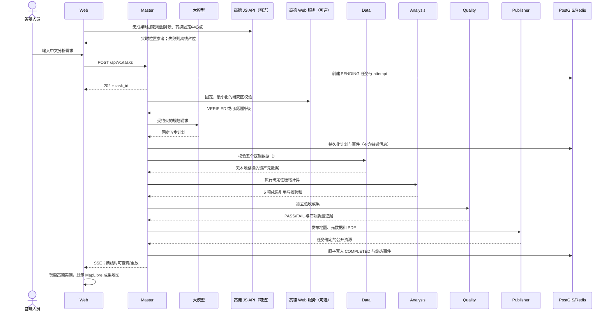

# 项目架构说明

本文档帮助接手答辩、运维或继续开发的人员理解：
- 系统为什么这样拆分
- 一次任务如何流转
- 哪些边界不能在演示前临时改动

产品验收标准见 [`spec.md`](spec.md)，公共接口定义见 [`openapi.yaml`](openapi.yaml)。

## 1. 业务目标

系统回答一个固定而完整的问题：**神农溪流域在 2019-08-19 与 2024-08-12 之间的植被指数如何变化，结果是否通过独立质量检查，能否以地图和中文报告交付。**

它重点证明四件事：

1. **真实的大模型规划**：自然语言请求经过真实大模型规划，但模型只能选择批准的步骤，不能直接执行代码或传入任意路径
2. **真实的多 Agent 协作**：5 个 Agent 通过 HTTP 和共享契约协作，而不是在一个进程中互相调用
3. **真实的栅格计算**：NDVI、差值、变化分级、面积统计和质量指标来自真实的栅格计算
4. **真实的故障处理**：失败、断线、刷新和重试都有持久化证据，未完成或未通过质量检查的成果不能伪装成成功

**项目范围说明**：
本项目不是通用遥感平台。当前只支持批准的神农溪场景、两期影像和固定分析链。除了已批准的高德地图背景外，临时增加第二地区、任意上传、任意模型工具、其他高德图层或公开部署都属于范围变更。

## 2. 组件与职责

| 组件 | 宿主端口 | 核心职责 | 不负责的事情 |
| --- | ---: | --- | --- |
| Web | 3000 | 中文任务输入、就绪状态、Agent 时间线、高德背景地图/MapLibre 成果地图、指标展示、重试、报告下载 | 浏览器只接收 JS Key，服务端只接收安全密钥；不持有 Master 的 Web 服务 Key，不计算 GIS，不直连私有 Agent |
| Master Agent | 8000 | 公开 API、大模型规划、研究区校验、状态机、租约、编排、SSE 事件流、恢复 | 不直接读取任意用户文件，不替代专业 Agent 进行计算 |
| Data Agent | 不公开 | 按固定逻辑 ID 校验流域和四个输入栅格，返回不含路径的资产元数据 | 不接受路径或 URL，不生成分析成果 |
| Analysis Agent | 不公开 | 计算前后期 NDVI、差值、变化分级和面积统计，原子发布成果 | 不自行判定质量是否通过，不提供公开下载 |
| Quality Agent | 不公开 | 独立重新打开成果并验证完整性、网格、值域、统计和阈值 | 不信任 Analysis 自报的结论，不修改分析成果 |
| Publisher Agent | 8004 | 复核任务/质量/校验和，提供瓦片、元数据和任务绑定的 PDF | 不发布部分成果、跨任务成果、被篡改或未通过质量检查的成果 |
| PostGIS | 不公开 | 保存任务、attempt、步骤、事件、模型调用元数据、成果引用和流域几何 | 不保存 API Key、原始模型提示或响应正文 |
| Redis | 不公开 | 有界的 SSE 事件缓存与分发 | 不是工作流的事实来源 |

**网络隔离**：
Compose 使用 `public` 与 `private` 两张网络。只有 Web、Master、Publisher 加入 `public`；私有 Agent、PostGIS 和 Redis 不映射宿主端口。全部宿主端口只绑定 `127.0.0.1`，默认不对公网开放。

## 3. 一次任务如何完成



**关于高德服务**：
高德有两个彼此隔离的可选功能：
1. **Master 的 Web 服务调用**：只生成研究区位置证据
2. **浏览器的 JS API**：只在没有分析成果时提供地图背景

两者都不影响已批准的流域边界、日期、红光/近红外数据、阈值和计算公式。

**降级行为**：
- Web 服务未配置、超时或限流时，规范内的任务会记录 `DEGRADED` 后继续
- JS API 未配置或加载失败时，页面回退到离线占位图，任务状态不变
- 大模型调用失败时，系统可以使用明确标记的内置恢复计划继续固定链
- 页面和报告必须区分”真实大模型规划”和”恢复规划”

## 4. 状态机与重试

**合法状态流转**：

```text
PENDING → PLANNING → DATA_PREPARING → ANALYZING
        → QUALITY_CHECKING → PUBLISHING → COMPLETED
```

任一活动状态都可以进入 `FAILED`，但终态不能继续向前。

**重试机制**：
- 重试不是覆盖旧记录，而是创建新的 attempt
- 旧 attempt 的步骤和事件会保留
- 只有经过校验和复核的已完成步骤可以作为安全检查点复用
- 页面上的”已复用”表示成果经过重新验证，不表示跳过安全检查

**跨服务请求的身份标识**：
每个跨服务请求同时携带：
- `task_id`：任务身份
- `attempt`：第几次执行
- `correlation_id`：跨容器追踪标识
- 固定步骤类型和幂等键：防止重复或跨任务调用

这组身份必须在请求体、请求头、日志、数据库事件和成果引用中保持一致。

## 5. 数据与成果流

### 输入数据

- **流域边界**：HydroBASINS 派生的完整神农溪流域，随镜像打包，WGS84（EPSG:4326）坐标系
- **卫星影像**：Sentinel-2 L2A 的 B04（红光）/B08（近红外）波段
  - 日期：2019-08-19 与 2024-08-12
  - 分辨率：10 米
  - 坐标系：UTM 49N（EPSG:32649）
- **缓存文件**：四个约 161 MiB 的裁剪 GeoTIFF，通过 `data/manifest.json` 的大小和 SHA-256 固定，不进入 Git，答辩时不在线下载

**重要**：2024 数据使用已经批准的反射率修正。提供商的 COG 已处理 BOA 偏移，项目不重复应用 `-0.1`。任何日期、源产品、处理公式或流域的变化都必须重新走数据审批，不能只改文案。

### 生成成果

- Analysis 原子生成：前期 NDVI、后期 NDVI、NDVI 差值、变化分级和面积统计
- Quality 把独立报告写入单独的命名卷
- Publisher 复核通过后生成：资源元数据、XYZ PNG 瓦片和中文 PDF

### 命名卷的职责

| 命名卷 | 内容 | 删除影响 |
| --- | --- | --- |
| `postgres-data` | 工作流事实与任务历史 | 任务和重试历史丢失 |
| `redis-data` | 可重建的事件缓存 | 可从 PostGIS 降级恢复 |
| `data-cache` | 四个批准的输入栅格 | 真实分析无法开始，需重新复制缓存 |
| `artifacts` | Analysis/Publisher 成果 | 地图、统计和报告资源不可用 |
| `quality-reports` | 独立质量证据 | Publisher 不得发布对应成果 |

**警告**：`docker compose down` 保留这些卷；`docker compose down -v` 会删除它们，演示机器禁止使用后者。

## 6. 信任边界与安全设计

**网络边界**：
- 浏览器调用：Master 的任务/健康/SSE API、Publisher 的只读资源 API、批准的高德官方 JS/地图域名和 Web 的固定同源 `/_AMapService` 代理
- 没有其他第三方边界

**大模型输出验证**：
- 大模型输出先经过严格 JSON Schema、步骤白名单和固定依赖顺序验证
- 非法计划不能执行

**HTTP 客户端安全**：
- 所有上游 HTTP 客户端固定 HTTPS 来源
- 禁止重定向
- 限制连接/读取时间和响应体大小

**Agent 命令安全**：
- Data/Analysis/Quality/Publisher 的 HTTP 命令不包含任意文件路径
- 服务根据任务身份定位固定文件

**发布安全**：
- Publisher 每次访问都复核任务归属、媒体类型、字节数、SHA-256 和质量结论

**密钥隔离**：
- 大模型 Key 与高德 Web 服务 Key 只存在于 Master
- 高德安全密钥只存在于 Web 服务端
- 专用 Web 端（JS API）Key 按官方机制对浏览器可见，必须受域名限制并可轮换

**同源代理安全**：
- 固定目标主机、路径、方法、超时、响应大小和并发
- 拒绝客户端提供安全密钥、上游、重定向、私网地址或任意请求头
- 不能成为开放代理或 SSRF 通道

**高德请求限制**：
- 高德请求不包含完整用户提示、任务 ID、流域几何、影像或成果
- 浏览器只临时转换一个固定 WGS84 中心点
- 不缓存或持久化脚本、瓦片、道路、转换结果和原始响应

**适用范围说明**：
此边界适用于本地答辩。项目没有用户认证、TLS 终止、互联网入口、限流网关和远程密钥管理，因此不能把现有 Compose 直接暴露到公网。

## 7. 代码导航

| 路径 | 内容 |
| --- | --- |
| `apps/web/` | React/TypeScript、高德背景地图、同源安全代理与 MapLibre 成果前端 |
| `packages/contracts/` | 五个 Agent 共用的版本化 Pydantic 契约和状态机 |
| `packages/observability/` | 关联标识、结构化日志和健康基础设施 |
| `services/master/` | 公开 API、大模型/高德适配器、仓储、SSE、编排与恢复 |
| `services/data_agent/` | 数据清单、完整性和覆盖预检 |
| `services/analysis_agent/` | NDVI、差值、分类、统计和原子成果写入 |
| `services/quality_agent/` | 独立质量评估与报告 |
| `services/publisher_agent/` | 瓦片、元数据、PDF 和只读发布路由 |
| `infra/db/` | PostGIS 镜像与 Alembic 迁移 |
| `tests/integration/` | 确定性五 Agent 合同链验证 |
| `tests/e2e/` | 完整 Compose Playwright 旅程 |
| `data/manifest.json` | 数据来源、许可、处理方法和校验和事实来源 |

## 8. 关键设计取舍

1. **PostGIS 是事实来源，Redis 不是**  
   这样即使事件缓存损坏或清空，也不会改变任务结果。

2. **Agent 独立部署，通过契约协作**  
   成本是接口代码更多，收益是职责、失败和证据边界清楚。

3. **数据预缓存**  
   答辩不依赖影像下载，但交付时必须单独传递四个大文件并做预检。

4. **高德能力与成果地图隔离**  
   Master 只做可选地名校验；浏览器只做无成果时的实时地图背景参考。合法成果始终由 MapLibre 独占显示，GCJ-02 不与 WGS84 遥感图层叠加，第三方故障也不会阻断任务链。

5. **固定场景优先于通用能力**  
   项目用严格白名单换取可复现、安全和可答辩的结果。

持久化取舍的正式记录见 [`decisions/001-postgis-durable-workflow.md`](decisions/001-postgis-durable-workflow.md)。
