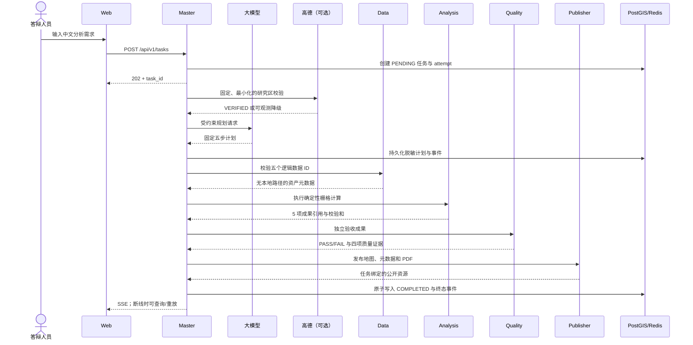

# 项目架构说明

本文帮助接手答辩、运维或继续开发的人员理解系统为什么这样拆分、一次任务如何流转，以及哪些
边界不能在演示前临时改动。产品验收口径以 [`spec.md`](spec.md) 为准，公共接口以
[`openapi.yaml`](openapi.yaml) 为准。

## 1. 业务目标

系统回答一个固定而完整的问题：神农溪流域在 2019-08-19 与 2024-08-12 之间的植被指数如何
变化，结果是否通过独立质量检查，能否以地图和中文报告交付。

它重点证明四件事：

1. 自然语言请求经过真实大模型规划，但模型只能选择批准的步骤，不能直接执行代码或传入路径；
2. 五个 Agent 通过 HTTP 和共享契约协作，而不是在一个进程中互相调用；
3. NDVI、差值、变化分级、面积统计和质量指标来自真实栅格计算；
4. 失败、断线、刷新和重试都有持久化证据，未完成或未通过质量检查的成果不能伪装成成功。

本项目不是通用遥感平台。当前只支持批准的神农溪场景、两期影像和固定分析链；临时增加第二
地区、任意上传、任意模型工具、高德底图或公开部署都属于范围变更。

## 2. 组件与职责

| 组件 | 宿主端口 | 核心职责 | 不负责的事情 |
| --- | ---: | --- | --- |
| Web | 3000 | 中文任务输入、就绪状态、Agent 时间线、地图、指标、重试、报告下载 | 不持有 Key，不计算 GIS，不直连私有 Agent |
| Master Agent | 8000 | 公开 API、大模型规划、研究区校验、状态机、租约、编排、SSE、恢复 | 不直接读取任意用户文件，不替代专业 Agent 计算 |
| Data Agent | 不公开 | 按固定逻辑 ID 校验流域和四个输入栅格，返回脱敏资产元数据 | 不接受路径或 URL，不生成分析成果 |
| Analysis Agent | 不公开 | 计算前后期 NDVI、差值、变化分级和面积统计，原子发布成果 | 不自行判定质量通过，不公开下载 |
| Quality Agent | 不公开 | 独立重开成果并验证完整性、网格、值域、统计和阈值 | 不信任 Analysis 自报结论，不修改分析成果 |
| Publisher Agent | 8004 | 复核任务/质量/校验和，提供瓦片、元数据和任务绑定 PDF | 不发布部分、跨任务、篡改或未通过成果 |
| PostGIS | 不公开 | 保存任务、attempt、步骤、事件、模型调用元数据、成果引用和流域几何 | 不保存 API Key、原始模型提示或响应正文 |
| Redis | 不公开 | 有界 SSE 事件缓存与分发 | 不是工作流事实来源 |

Compose 使用 `public` 与 `private` 两张网络。只有 Web、Master、Publisher 加入 `public`；私有 Agent、
PostGIS 和 Redis 不映射宿主端口。全部宿主端口只绑定 `127.0.0.1`，默认不是公网服务。

## 3. 一次任务如何完成



高德只影响位置证据，不影响 G2 已批准的流域边界、日期、红光/近红外数据、阈值和计算公式。
高德未配置、超时或限流时，规范内任务记录 `DEGRADED` 后继续。大模型调用失败时，系统可以使用
明确标记的内置恢复计划继续固定链；页面和报告必须区分“真实大模型规划”和“恢复规划”。

## 4. 状态机与重试

合法状态只有：

```text
PENDING → PLANNING → DATA_PREPARING → ANALYZING
        → QUALITY_CHECKING → PUBLISHING → COMPLETED
```

任一活动状态都可以进入 `FAILED`，终态不能继续向前。重试不是覆盖旧记录，而是创建新的 attempt，
保留旧 attempt 的步骤和事件；只有经过校验和复核的已完成步骤可以作为安全检查点复用。页面上的
“已复用”表示成果经过重新验证，不表示跳过安全检查。

每个跨服务请求同时携带：

- `task_id`：任务身份；
- `attempt`：第几次执行；
- `correlation_id`：跨容器追踪标识；
- 固定步骤类型和幂等键：防止重复或跨任务调用。

这组身份必须在请求体、请求头、日志、数据库事件和成果引用中一致。

## 5. 数据与成果流

### 输入数据

- 流域：HydroBASINS 派生的完整神农溪流域，随镜像打包，WGS84（EPSG:4326）；
- 影像：Sentinel-2 L2A 的 B04/B08，2019-08-19 与 2024-08-12，10 米分辨率，
  UTM 49N（EPSG:32649）；
- 缓存：四个约 161 MiB 的裁剪 GeoTIFF 通过 `data/manifest.json` 的大小和 SHA-256 固定，
  不进入 Git，答辩时不在线下载。

2024 数据使用已经批准的反射率修正：提供商 COG 已处理 BOA 偏移，项目不重复应用 `-0.1`。
任何日期、源产品、处理公式或流域变化都必须重新走数据审批，不能只改文案。

### 生成成果

Analysis 原子生成前期 NDVI、后期 NDVI、NDVI 差值、变化分级和面积统计。Quality 把独立报告写入
单独命名卷。Publisher 复核通过后生成资源元数据、XYZ PNG 瓦片和中文 PDF。

命名卷的职责如下：

| 命名卷 | 内容 | 删除影响 |
| --- | --- | --- |
| `postgres-data` | 工作流事实与任务历史 | 任务和重试历史丢失 |
| `redis-data` | 可重建的事件缓存 | 可从 PostGIS 降级恢复 |
| `data-cache` | 四个批准的输入栅格 | 真实分析无法开始，需重新复制缓存 |
| `artifacts` | Analysis/Publisher 成果 | 地图、统计和报告资源不可用 |
| `quality-reports` | 独立质量证据 | Publisher 不得发布对应成果 |

`docker compose down` 保留这些卷；`docker compose down -v` 会删除它们，演示机器禁止使用后者。

## 6. 信任边界与安全设计

- 浏览器只调用 Master 的任务/健康/SSE API 和 Publisher 的只读资源 API。
- 大模型输出先经过严格 JSON Schema、步骤白名单和固定依赖顺序验证；非法计划不能执行。
- 所有上游 HTTP 客户端固定 HTTPS 来源、禁止重定向、限制连接/读取时间和响应体大小。
- Data/Analysis/Quality/Publisher 的 HTTP 命令不包含任意文件路径；服务根据任务身份定位固定文件。
- Publisher 每次访问都复核任务归属、媒体类型、字节数、SHA-256 和质量结论。
- API Key 只存在于 Master 环境变量；日志、数据库、Redis、浏览器、报告和 Git 都不得出现真实值。
- 高德请求不包含完整用户提示、任务 ID、流域几何、影像或成果，也不缓存原始响应。

此边界适用于本地答辩。项目没有用户认证、TLS 终止、互联网入口、限流网关和远程密钥管理，
因此不能把现有 Compose 直接暴露到公网。

## 7. 代码导航

| 路径 | 内容 |
| --- | --- |
| `apps/web/` | React/TypeScript/MapLibre 前端 |
| `packages/contracts/` | 五个 Agent 共用的版本化 Pydantic 契约和状态机 |
| `packages/observability/` | 关联标识、结构化日志和健康基础设施 |
| `services/master/` | 公开 API、大模型/高德适配器、仓储、SSE、编排与恢复 |
| `services/data_agent/` | 数据清单、完整性和覆盖预检 |
| `services/analysis_agent/` | NDVI、差值、分类、统计和原子成果写入 |
| `services/quality_agent/` | 独立质量评估与报告 |
| `services/publisher_agent/` | 瓦片、元数据、PDF 和只读发布路由 |
| `infra/db/` | PostGIS 镜像与 Alembic 迁移 |
| `tests/integration/` | 确定性五 Agent 合同链验证 |
| `tests/e2e/` | 完整 Compose Playwright 旅程 |
| `data/manifest.json` | 数据来源、许可、处理方法和校验和事实来源 |

## 8. 关键设计取舍

1. **PostGIS 是事实来源，Redis 不是。** 这样事件缓存损坏或清空不会改变任务结果。
2. **Agent 独立部署，通过契约协作。** 成本是接口代码更多，收益是职责、失败和证据边界清楚。
3. **数据预缓存。** 答辩不依赖影像下载，但交付时必须单独传递四个大文件并做预检。
4. **高德只做可选地名校验。** 避免 GCJ-02 与 WGS84 叠加误差，也避免第三方故障阻断遥感链。
5. **固定场景优先于通用能力。** 项目用严格白名单换取可复现、安全和可答辩的结果。

持久化取舍的正式记录见
[`decisions/001-postgis-durable-workflow.md`](decisions/001-postgis-durable-workflow.md)。
